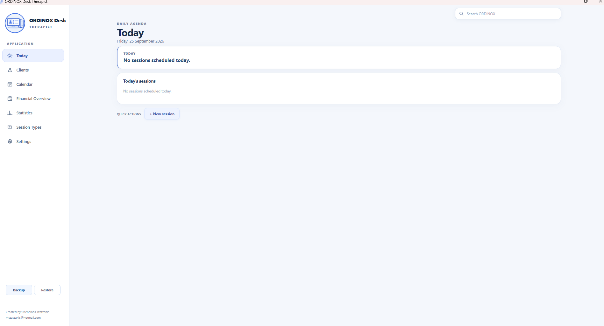
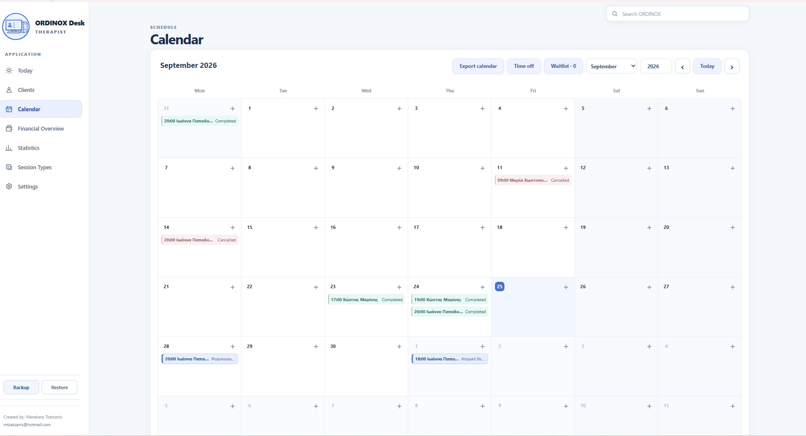
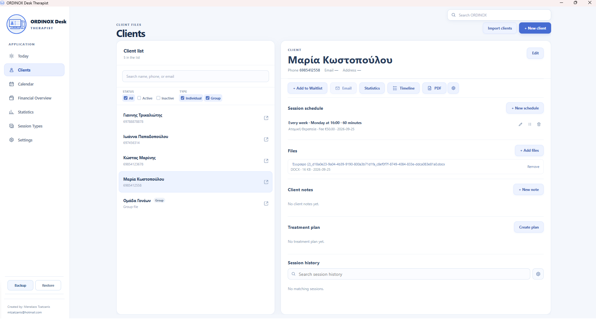
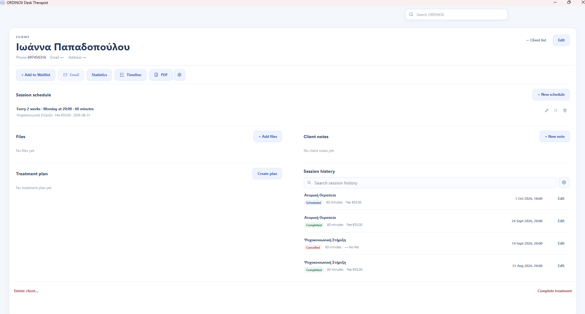
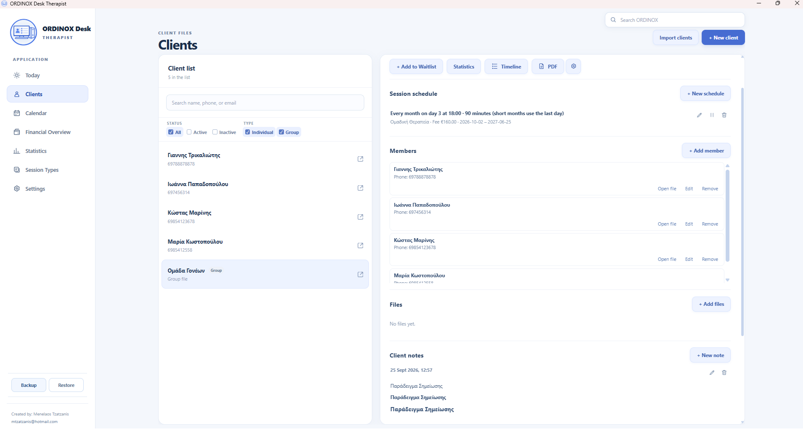
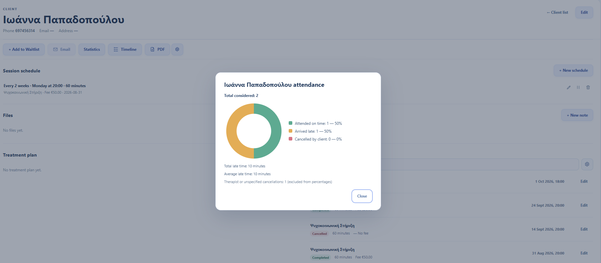
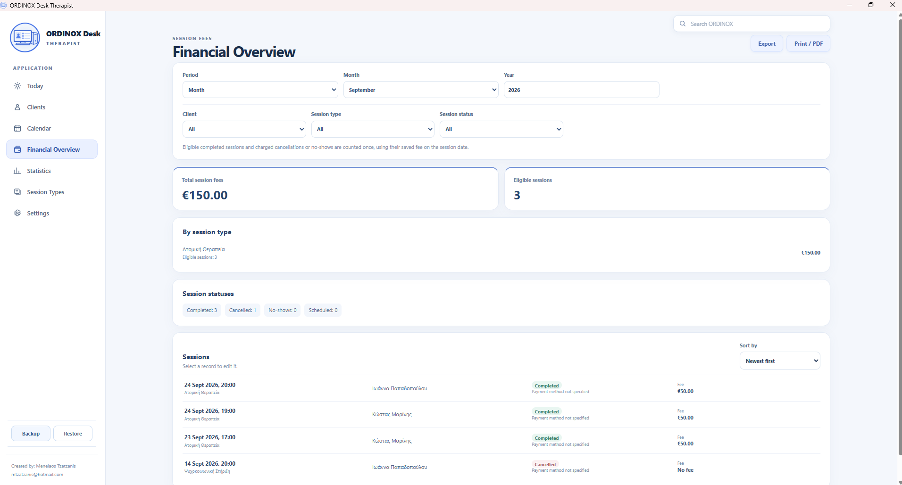
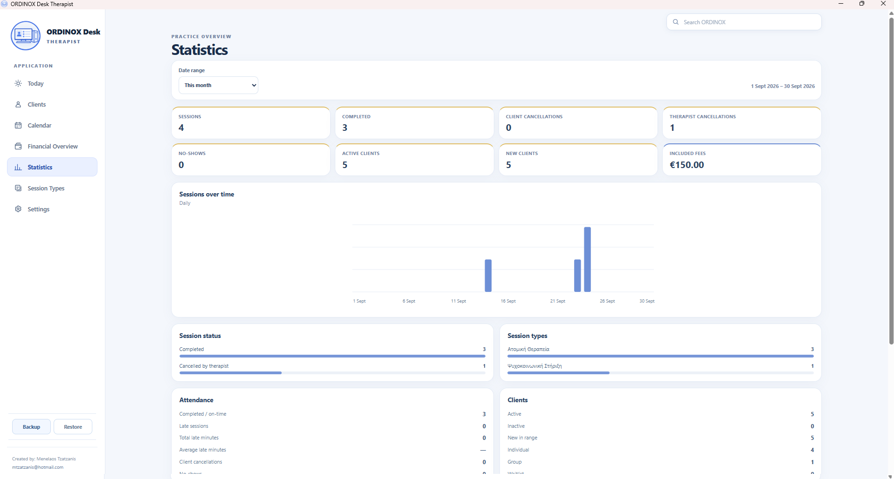
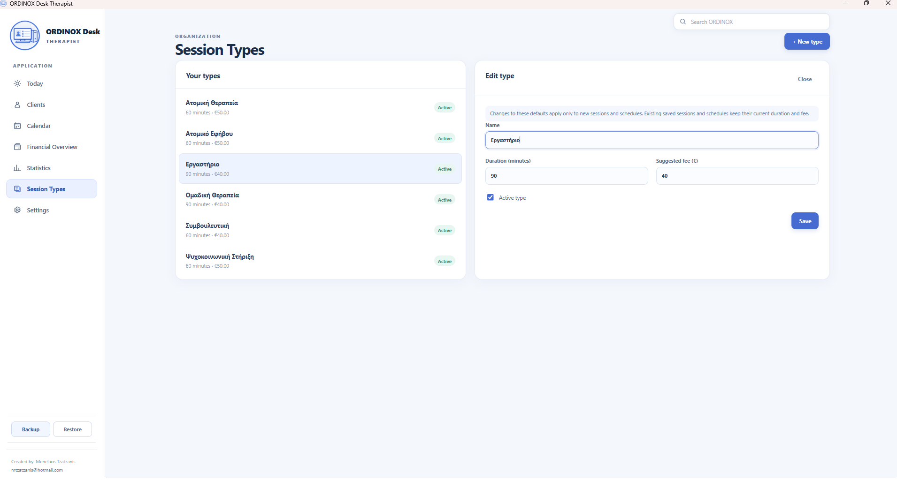
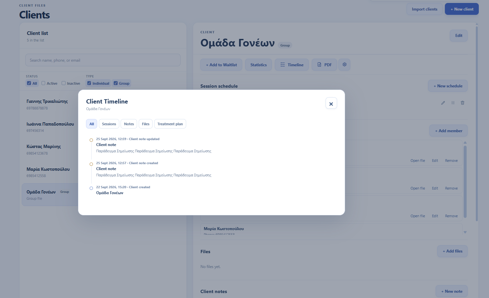

# ORDINOX Desk Therapist

**Local-first Windows desktop practice management software for therapists and mental-health professionals.**

[English](README.md) · [Ελληνικά](README_GR.md)

---

## Overview

ORDINOX Desk Therapist is a Windows desktop application designed to support the day-to-day organization of a private therapy practice.

It brings together client management, scheduling, session records, treatment planning, financial tracking, statistics, documents and practice tools in a focused desktop interface.

The application follows a **local-first approach**, with practice data managed locally on the user's Windows computer during normal operation.

> **Portfolio showcase:** This public repository presents the application and its interface. The application's source code is not published in this repository.

> **Demo data:** All names, phone numbers, notes, appointments and other personal information visible in the screenshots are fictitious demo data created exclusively for presentation purposes.

---

## Today

The Today view provides a focused daily overview of the practice, including upcoming sessions and quick access to the most common daily actions.

---

## Calendar & Scheduling

The Calendar provides a visual overview of scheduled sessions and supports both one-off appointments and recurring schedules.

Scheduling tools include:

- One-off sessions
- Recurring schedules
- Session status tracking
- Working-hours guidance
- Time Off
- Waitlist
- Calendar export
- Historical session preservation

---

## Client Management

ORDINOX uses a desktop split-view interface that allows the therapist to browse the Client List while working with the selected Client File.

The application supports both **Individual Clients** and **Groups**.

---

## Client File

Each Client has a structured workspace containing the information and tools required for ongoing practice management.

Depending on the Client and enabled features, the Client File can include:

- Session schedules
- Session history
- Client notes
- Treatment Plans and Goals
- Managed documents
- Attendance statistics
- Client Timeline
- PDF output

---

## Group Clients

Groups are managed as full Client entities and can be linked to existing Individual Clients.

This allows group schedules and history to remain organized while Individual Client records continue to exist independently.

---

## Attendance

ORDINOX provides Client-level attendance information with visual summaries for completed sessions, lateness and cancellations.

---

## Financial Overview

The Financial Overview provides a focused session-fee view of the practice.

It includes:

- Date filtering
- Client filtering
- Session Type filtering
- Session-status filtering
- Included-fee totals
- Session breakdown
- CSV export
- Native Excel `.xlsx` export
- PDF output

---

## Statistics

Practice Statistics provide an at-a-glance overview of activity for a selected period.

Available information includes:

- Sessions
- Completed sessions
- Client cancellations
- Therapist cancellations
- No-shows
- Active Clients
- New Clients
- Included fees
- Attendance
- Session Types
- Session trends

All statistics are calculated locally from the application's database.

---

## Session Types

Therapists can create their own Session Types with a default duration and suggested fee.

Session Types act as reusable defaults for new sessions and schedules while already saved sessions preserve their existing values.

---

## Client Timeline

The Client Timeline provides a chronological view of important Client activity.

Depending on available data, it can include:

- Sessions
- Client notes
- Session notes
- Files
- Treatment Plans
- Goals
- Other relevant Client events

Results are loaded in bounded pages to keep the interface responsive even with long Client histories.

---

## Additional Features

ORDINOX Desk Therapist also includes:

- Global local search
- Rich Client notes
- Rich Session notes
- Reusable Session Note Templates
- Quick note snippets
- Treatment Plans and Goals
- Managed Client documents
- Working Hours
- Time Off
- Waitlist
- CSV Client import
- Excel `.xlsx` financial export
- Calendar `.ics` export
- PDF generation
- Local Backup and Restore
- Optional Tasks / Follow-ups

---

## Local-First Architecture

ORDINOX Desk Therapist is designed as a local-first Windows application.

Normal operation does not require:

- A cloud account
- A remote database server
- Browser-based hosting
- Continuous internet connectivity
- External analytics or telemetry services

The application is designed to keep normal practice data on the local Windows computer.

---

## Technology

The application is built with:

- **Tauri 2**
- **Rust**
- **SQLite**
- **Vanilla JavaScript**
- **HTML5**
- **CSS3**

The Rust backend handles database operations, scheduling logic, files, backup and restore, imports, exports and other native desktop functionality.

---

## Performance & Reliability

The application is designed around bounded database queries, local processing and on-demand operations.

Development and regression testing includes scenarios involving:

- Approximately 1,000 Clients
- Tens of thousands of Sessions
- Large local search indexes
- Thousands of managed files
- Long recurring-session histories

Potentially expensive operations such as imports, exports and filesystem recovery are performed only when required rather than continuously in the background.

---

## Privacy Note

The screenshots in this repository contain **only fictitious demonstration data**.

No real Client, patient or therapy-practice information is included.

---

## Project Status

**Active development / pre-release**

ORDINOX Desk Therapist is currently undergoing final usability, security and commercial-release preparation.

This repository is intended solely as a **portfolio and product showcase**.

Source code and production binaries are not distributed through this repository.

---

## Author

Designed and developed by **Menelaos Tzatzanis**.

Part of the **ORDINOX** desktop software project family.

© 2026 Menelaos Tzatzanis. All rights reserved.
