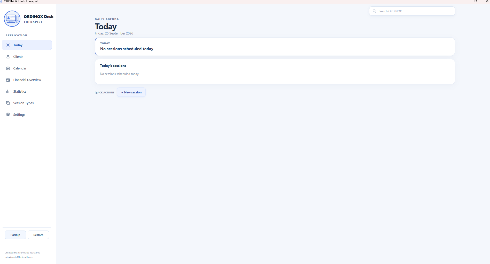
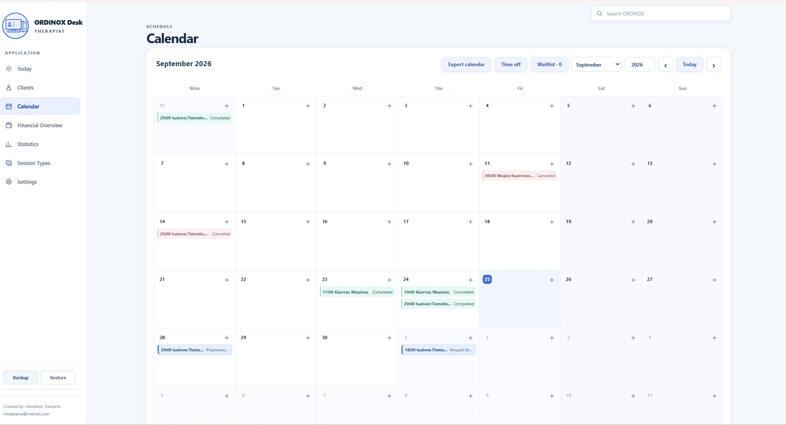
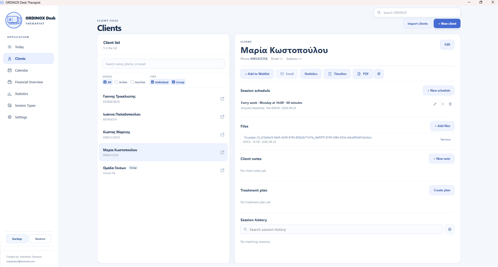
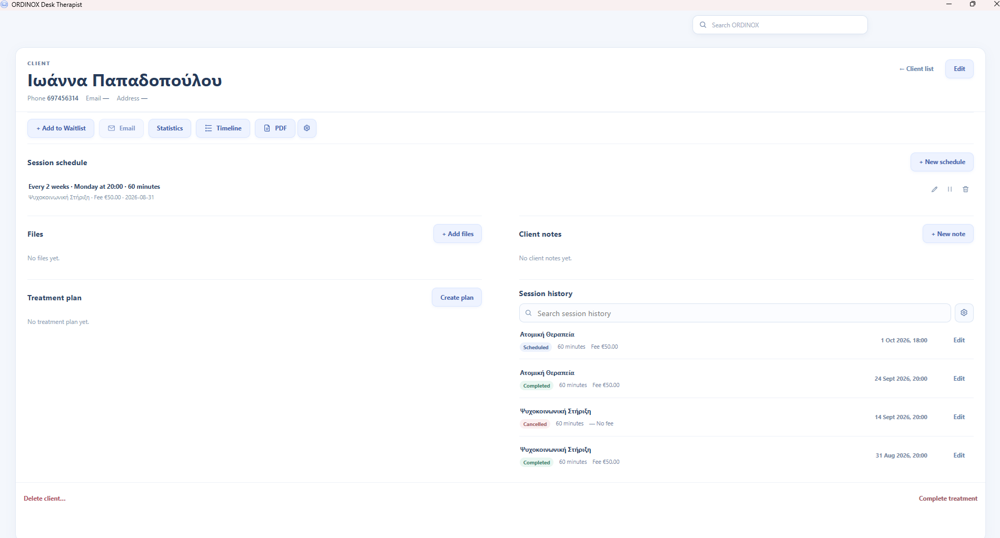
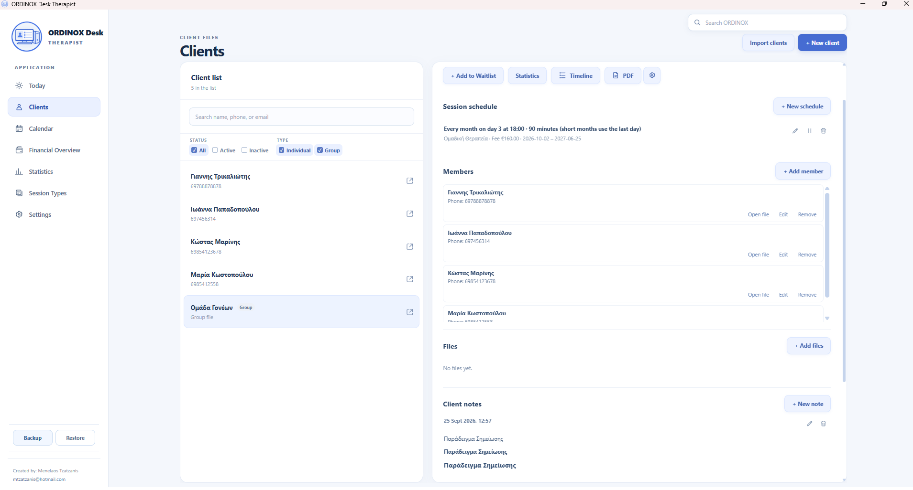
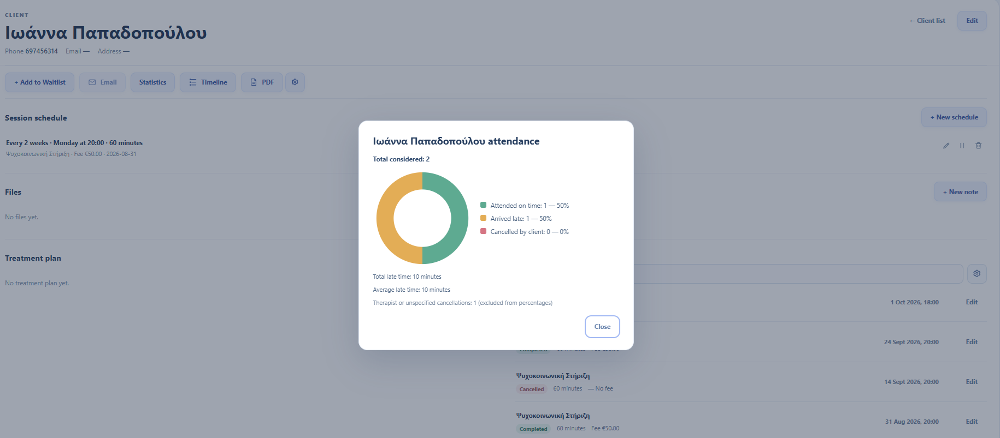
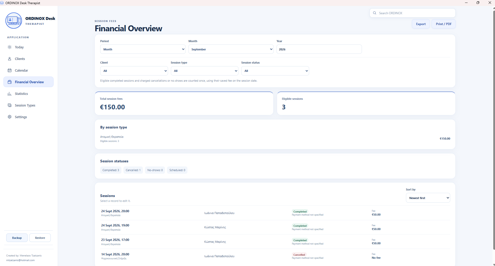
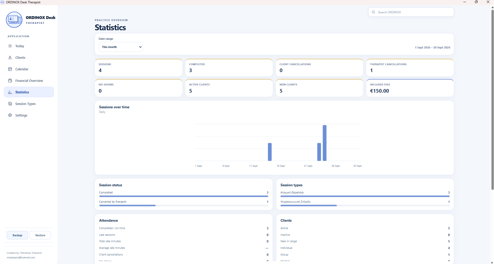
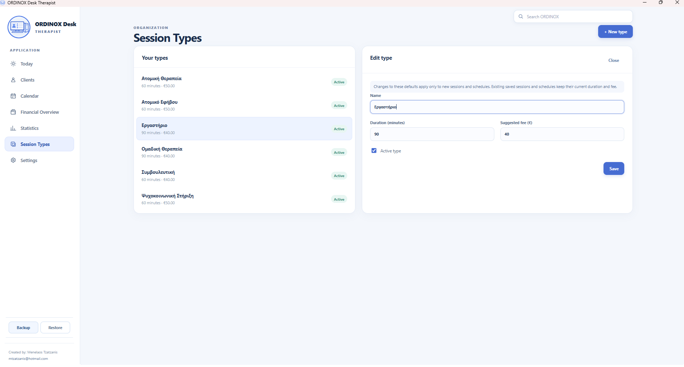
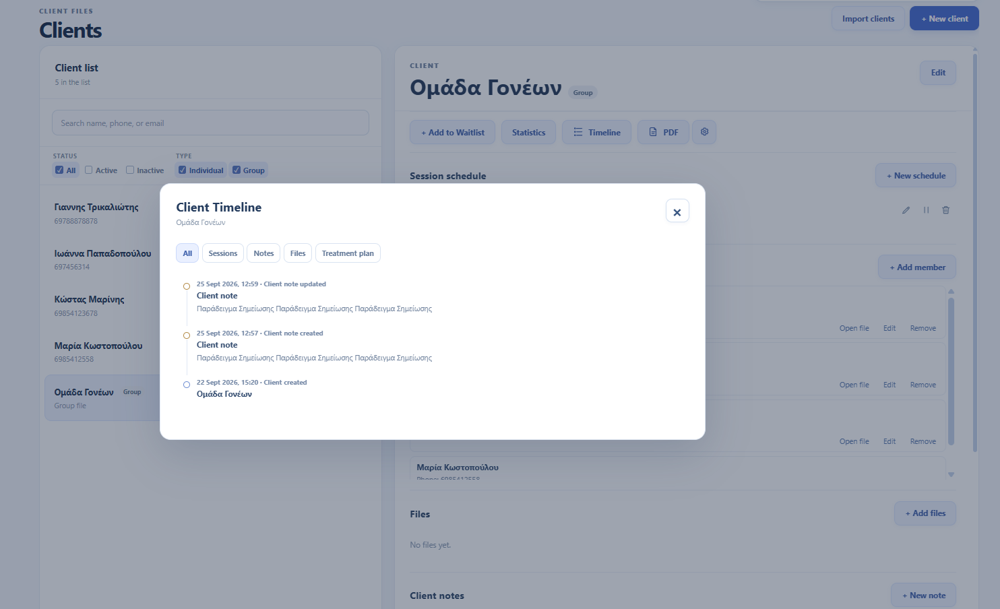

# ORDINOX Desk Therapist

**Local-first εφαρμογή Windows για διαχείριση ιδιωτικού γραφείου θεραπευτών και επαγγελματιών ψυχικής υγείας.**

[English](README.md) · [Ελληνικά](README_GR.md)

---

## Παρουσίαση

Το ORDINOX Desk Therapist είναι μια desktop εφαρμογή για Windows, σχεδιασμένη για την καθημερινή οργάνωση ενός ιδιωτικού θεραπευτικού ή mental-health γραφείου.

Συγκεντρώνει σε ένα ενιαίο περιβάλλον τη διαχείριση πελατών, τον προγραμματισμό συνεδριών, το ιστορικό, το attendance, τις σημειώσεις, τα έγγραφα, τα οικονομικά στοιχεία, τα στατιστικά, τα exports, το backup και προαιρετικά εργαλεία οργάνωσης της θεραπευτικής πρακτικής.

Η εφαρμογή ακολουθεί **local-first σχεδιασμό**, ώστε κατά την κανονική λειτουργία τα δεδομένα του γραφείου να αποθηκεύονται και να διαχειρίζονται τοπικά στη συσκευή Windows του χρήστη.

Είναι σχεδιασμένη για **Windows PCs και Windows tablets**, με υποστήριξη **Αγγλικού και Ελληνικού περιβάλλοντος**.

> **Portfolio showcase:** Αυτό το δημόσιο repository παρουσιάζει την εφαρμογή και το περιβάλλον εργασίας της. Ο production πηγαίος κώδικας διατηρείται ιδιωτικός και δεν δημοσιεύεται εδώ.

> **Demo δεδομένα:** Όλα τα ονόματα, τηλέφωνα, σημειώσεις, ραντεβού και λοιπές προσωπικές πληροφορίες που εμφανίζονται στα screenshots είναι φανταστικά δεδομένα επίδειξης και χρησιμοποιούνται αποκλειστικά για την παρουσίαση της εφαρμογής.

---

## Today

Η οθόνη Today παρέχει μια εστιασμένη εικόνα της ημέρας.

Ανάλογα με τα ενεργοποιημένα features και τα διαθέσιμα δεδομένα, μπορεί να εμφανίζει:

- Επερχόμενες συνεδρίες
- Καθημερινή δραστηριότητα
- Γρήγορη πρόσβαση σε συχνές ενέργειες
- Υπενθυμίσεις
- Πληροφορίες Backup Health
- Προαιρετικές πληροφορίες Follow-up

---

## Ημερολόγιο & Προγραμματισμός

Το Calendar παρέχει οπτική εικόνα των προγραμματισμένων συνεδριών και υποστηρίζει τόσο μεμονωμένα ραντεβού όσο και επαναλαμβανόμενα schedules.

Περιλαμβάνει:

- One-off συνεδρίες
- Επαναλαμβανόμενα schedules
- Παρακολούθηση κατάστασης συνεδρίας
- Πολλαπλά recurrence patterns
- Working Hours guidance
- Time Off
- Waitlist
- Calendar export
- Διατήρηση ιστορικού επαναλαμβανόμενων συνεδριών

Τα Working Hours είναι **συμβουλευτικά και όχι περιοριστικά**.

Μια συνεδρία μπορεί να καταχωριστεί και εκτός Working Hours. Όταν τα warnings είναι ενεργοποιημένα, το ORDINOX μπορεί να εμφανίσει σχετική προειδοποίηση και να επιτρέψει στον χρήστη να συνεχίσει.

---

## Διαχείριση Clients

Το ORDINOX χρησιμοποιεί desktop split-view interface ώστε ο επαγγελματίας να μπορεί να βλέπει τη λίστα Clients και ταυτόχρονα να εργάζεται στον επιλεγμένο Client File.

Η εφαρμογή υποστηρίζει:

- Individual Clients
- Group Clients
- Active και Inactive Clients
- Αναζήτηση και φίλτρα
- Οργανωμένους Client Files
- Ιστορικό και αρχεία ανά Client

---

## Client File

Κάθε Client διαθέτει οργανωμένο workspace με τις πληροφορίες και τα εργαλεία που απαιτούνται για την καθημερινή διαχείριση.

Ανάλογα με τον Client και τα ενεργοποιημένα optional features, ο Client File μπορεί να περιλαμβάνει:

- Session schedules
- Session history
- Client notes
- Session notes
- Managed documents
- Attendance statistics
- Client Timeline
- PDF output
- Προαιρετικά Treatment Plans και Goals
- Προαιρετικά Tasks / Follow-ups

---

## Group Clients

Τα Groups διαχειρίζονται ως Client entities και μπορούν να συνδέονται με υπάρχοντες Individual Clients.

Έτσι τα group schedules και το group history παραμένουν οργανωμένα, ενώ οι ατομικοί Client Files συνεχίζουν να υπάρχουν ανεξάρτητα.

Τα μέλη του Group χρησιμοποιούν τους συνδεδεμένους Individual Clients ως source of truth για τα προσωπικά τους στοιχεία.

---

## Session History & Attendance

Το ORDINOX διατηρεί οργανωμένο ιστορικό συνεδριών μαζί με attendance πληροφορίες.

Το attendance μπορεί να περιλαμβάνει:

- Completed sessions
- Client cancellations
- Therapist cancellations
- No-shows
- Lateness

Τα ιστορικά recurring occurrences διατηρούνται ώστε μεταγενέστερες αλλαγές σε schedules να μην τροποποιούν σιωπηλά το παλιό session history.

---

## Financial Overview

Το Financial Overview παρέχει οργανωμένη εικόνα των session fees.

Περιλαμβάνει:

- Φίλτρα ημερομηνίας
- Client filtering
- Session Type filtering
- Session-status filtering
- Included-fee totals
- Session breakdown
- CSV export
- Native Excel `.xlsx` export
- PDF output

Η εφαρμογή ξεχωρίζει μια συνεδρία χωρίς αποθηκευμένο fee από μια συνεδρία με μηδενικό fee.

---

## Statistics

Τα Statistics παρέχουν συνοπτική εικόνα της δραστηριότητας του γραφείου για επιλεγμένο χρονικό διάστημα.

Μπορούν να περιλαμβάνουν:

- Sessions
- Completed sessions
- Client cancellations
- Therapist cancellations
- No-shows
- Active Clients
- New Clients
- Included fees
- Attendance
- Session Types
- Session trends

Οι υπολογισμοί πραγματοποιούνται τοπικά από τη βάση δεδομένων της εφαρμογής.

---

## Session Types

Ο επαγγελματίας μπορεί να δημιουργεί δικά του Session Types με default διάρκεια και προτεινόμενο fee.

Τα Session Types λειτουργούν ως reusable defaults για νέες συνεδρίες και schedules.

Μεταγενέστερες αλλαγές σε ένα Session Type δεν αλλάζουν αναδρομικά τιμές που έχουν ήδη αποθηκευτεί σε προηγούμενες συνεδρίες.

---

## Client Timeline

Το Client Timeline παρέχει χρονολογική εικόνα σημαντικής δραστηριότητας που σχετίζεται με έναν Client.

Ανάλογα με τα διαθέσιμα δεδομένα και τα ενεργοποιημένα features, μπορεί να περιλαμβάνει:

- Sessions
- Client notes
- Session notes
- Files
- Treatment Plans
- Goals
- Tasks / Follow-ups
- Άλλα σχετικά Client events

Τα αποτελέσματα φορτώνονται σε bounded pages ώστε το interface να παραμένει responsive ακόμη και με μεγάλο ιστορικό.

---

## Notes & Reusable Content

Το ORDINOX περιλαμβάνει structured note tools για Clients και μεμονωμένες Sessions.

Περιλαμβάνονται:

- Rich Client notes
- Rich Session notes
- Ελεγχόμενο text formatting
- Session Note Templates
- Quick Snippets
- Plain-text projection για search και reporting

Οι σημειώσεις χρησιμοποιούν ελεγχόμενο structured format και όχι arbitrary raw HTML.

---

## Προαιρετικές Λειτουργίες

Το ORDINOX είναι σχεδιασμένο ώστε η βασική εμπειρία να παραμένει απλή και εστιασμένη.

Πρόσθετα features μπορούν να ενεργοποιούνται από τα Settings όταν είναι χρήσιμα.

### Tasks / Follow-ups

Τα Tasks είναι ενέργειες που πρέπει να πραγματοποιήσει ο επαγγελματίας.

Μπορούν να σχετίζονται με συγκεκριμένο Client ή να χρησιμοποιούνται ως γενικά follow-ups.

Τα Tasks είναι προαιρετικά και μπορούν να ενεργοποιούνται ή να απενεργοποιούνται από τα Settings.

Η απενεργοποίηση των Tasks **δεν διαγράφει** ήδη αποθηκευμένα Task data.

### Treatment Plans / Goals

Τα Treatment Plans περιγράφουν τι προσπαθεί να επιτύχει ο επαγγελματίας μαζί με τον Client.

Τα Goals είναι οι επιμέρους θεραπευτικοί στόχοι ή τα βήματα μέσα σε αυτό το plan.

Τα Treatment Plans και Goals είναι προαιρετικά και μπορούν να ενεργοποιούνται ή να απενεργοποιούνται από τα Settings.

Η απενεργοποίηση του feature **δεν διαγράφει** ήδη αποθηκευμένα Treatment Plans ή Goals.

Με αυτόν τον τρόπο, η βασική εφαρμογή μπορεί να παραμένει πιο απλή, ενώ ο επαγγελματίας προσθέτει επιπλέον structured εργαλεία όταν τα χρειάζεται.

---

## Managed Documents

Έγγραφα που σχετίζονται με Clients μπορούν να εισάγονται και να διαχειρίζονται τοπικά μέσα από την εφαρμογή.

Η σχετική ροή είναι σχεδιασμένη γύρω από:

- Local managed copies
- Safe import
- Missing-file detection
- Recovery handling
- Client-based organization

Η εφαρμογή αποφεύγει περιττά full filesystem scans κατά το κανονικό clean startup.

---

## Search

Το ORDINOX περιλαμβάνει local Global Search.

Η αναζήτηση μπορεί να βοηθά στον εντοπισμό πληροφοριών σε περιοχές όπως:

- Clients
- Sessions
- Notes
- Documents
- Άλλες indexed πληροφορίες του γραφείου

Το Search λειτουργεί τοπικά και δεν απαιτεί remote search service.

---

## Backup & Restore

Το Backup και Restore αποτελούν σημαντικό μέρος της εφαρμογής.

Το σύστημα είναι σχεδιασμένο ώστε να υποστηρίζει:

- Local backup creation
- Database backup
- Managed-document backup
- Streaming archive creation
- Backup validation
- Restore staging
- Restore validation
- Recovery από interrupted restore operations
- Forward migration υποστηριζόμενων παλαιότερων backups

Στόχος είναι τα δεδομένα του γραφείου να παραμένουν φορητά και ανακτήσιμα χωρίς εξάρτηση από cloud service.

---

## Import & Export

Το ORDINOX περιλαμβάνει διάφορα εργαλεία φορητότητας δεδομένων, όπως:

- CSV Client import
- Financial CSV export
- Native Excel `.xlsx` financial export
- Calendar `.ics` export
- PDF generation
- Local Backup και Restore

Τα exports δημιουργούνται τοπικά από τα αποθηκευμένα δεδομένα της εφαρμογής.

---

## Local-First Αρχιτεκτονική

Το ORDINOX Desk Therapist είναι σχεδιασμένο ως local-first Windows εφαρμογή.

Για την κανονική χρήση δεν απαιτείται:

- Cloud account
- Remote database server
- Browser-based hosting
- Συνεχής σύνδεση στο Internet
- Εξωτερική υπηρεσία analytics ή telemetry

Τα κανονικά δεδομένα του γραφείου είναι σχεδιασμένα ώστε να παραμένουν στη συσκευή Windows του χρήστη.

---

## Windows PC & Tablet

Το ORDINOX Desk Therapist είναι σχεδιασμένο για:

- Windows desktop υπολογιστές
- Windows laptops
- Windows tablets

Το interface διαθέτει responsive behavior και zoom support ώστε να παραμένει πρακτικό σε διαφορετικά μεγέθη οθόνης Windows.

Η εφαρμογή μπορεί να διατίθεται με **Αγγλικό και Ελληνικό περιβάλλον**.

---

## Φιλοσοφία Προϊόντος

Το ORDINOX Desk Therapist βασίζεται σε μια απλή αρχή:

**οι πληροφορίες και τα καθημερινά εργαλεία ενός ιδιωτικού γραφείου να βρίσκονται συγκεντρωμένα, χωρίς η εφαρμογή να μετατρέπεται σε ένα αχρείαστα πολύπλοκο σύστημα.**

Η βασική εμπειρία επικεντρώνεται σε Clients, scheduling, sessions, notes, records, οικονομικά και οργάνωση του γραφείου.

Πρόσθετα features μπορούν να παραμένουν προαιρετικά, ώστε κάθε επαγγελματίας να διατηρεί την εφαρμογή όσο απλή ή όσο structured επιθυμεί.

---

## Μελλοντικό Εμπορικό Μοντέλο

Για μελλοντικές εμπορικές εκδόσεις, η κατεύθυνση είναι απλή:

- Εφάπαξ αγορά
- Τοπική εγκατάσταση
- Χωρίς υποχρεωτική συνεχή συνδρομή για να συνεχίσει ο χρήστης να χρησιμοποιεί την έκδοση που αγόρασε
- Τοπική διαχείριση των κανονικών δεδομένων της εφαρμογής

Μελλοντικά μπορεί να προσφέρονται πρόσθετα optional features ή πιο προσαρμοσμένες εκδόσεις ανάλογα με τις ανάγκες των επαγγελματιών.

---

## Τεχνολογία

Η εφαρμογή χρησιμοποιεί:

- **Tauri 2**
- **Rust**
- **SQLite**
- **Vanilla JavaScript**
- **HTML5**
- **CSS3**

Το Rust backend διαχειρίζεται database operations, scheduling logic, files, Backup/Restore, imports, exports και άλλες native desktop λειτουργίες.

---

## Performance & Reliability

Η εφαρμογή είναι σχεδιασμένη γύρω από bounded database queries, local processing και on-demand operations.

Η ανάπτυξη και τα regression tests περιλαμβάνουν σενάρια με:

- Περίπου 1.000 Clients
- Δεκάδες χιλιάδες Sessions
- Μεγάλα local search indexes
- Χιλιάδες managed files
- Μεγάλο recurring-session history

Βαρύτερες λειτουργίες όπως imports, exports, recurrence synchronization και filesystem recovery είναι σχεδιασμένες ώστε να αποφεύγουν περιττή συνεχή background εργασία.

---

## Προσέγγιση Ανάπτυξης

Το ORDINOX Desk Therapist αναπτύσσεται σταδιακά, με έμφαση στη διατήρηση της υπάρχουσας συμπεριφοράς και στην προστασία των δεδομένων του χρήστη.

Η διαδικασία περιλαμβάνει:

1. Έλεγχο της υπάρχουσας συμπεριφοράς
2. Σχεδιασμό της απαιτούμενης αλλαγής
3. Υλοποίηση στοχευμένων αλλαγών
4. Εκτέλεση regression tests
5. Έλεγχο πιθανών side effects
6. Έλεγχο επιπτώσεων σε performance και data safety
7. Βελτίωση του interface όπου απαιτείται

Αποφεύγονται μεγάλα rewrites όταν δεν υπάρχει ισχυρός τεχνικός λόγος.

---

## AI-Assisted Development

Η χρήση AI-assisted software development αποτελεί μέρος του workflow μου, συμπεριλαμβανομένου του **OpenAI Codex**.

Τα εργαλεία AI χρησιμοποιούνται για:

- Existing code analysis
- Feature implementation
- Debugging
- Regression investigation
- Code refinement
- Testing assistance
- Performance review
- Έλεγχο πιθανών side effects

Οι αλλαγές που προτείνονται από AI ελέγχονται και δοκιμάζονται σταδιακά και δεν εφαρμόζονται μηχανικά.

Το workflow συνδυάζει AI-assisted implementation με χειροκίνητη επαλήθευση, testing, debugging και αποφάσεις προϊόντος.

---

## Privacy

Τα screenshots σε αυτό το repository περιλαμβάνουν **μόνο φανταστικά δεδομένα επίδειξης**.

Δεν περιλαμβάνονται πραγματικά δεδομένα Clients, patients ή θεραπευτικού γραφείου.

---

## Source Code

Ο πλήρης production πηγαίος κώδικας του ORDINOX Desk Therapist διατηρείται ιδιωτικός.

Αυτό το repository λειτουργεί αποκλειστικά ως **product showcase και portfolio παρουσίαση**, με documentation και οπτικό υλικό της εφαρμογής.

Ο πλήρης production source code δεν περιλαμβάνεται σε αυτό το δημόσιο repository.

---

## Κατάσταση Project

**Ενεργή ανάπτυξη / pre-release.**

Το ORDINOX Desk Therapist βρίσκεται στην τελική φάση product-development προετοιμασίας πριν από μεταγενέστερα στάδια security, packaging και commercial release.

Η βασική functional εφαρμογή είναι λειτουργική και συνεχίζει να δέχεται usability και product refinements.

---

## Δημιουργός

Σχεδιασμός και ανάπτυξη: **Menelaos Tzatzanis**

Μέρος της οικογένειας desktop εφαρμογών **ORDINOX**.

© 2026 Menelaos Tzatzanis. All rights reserved.
